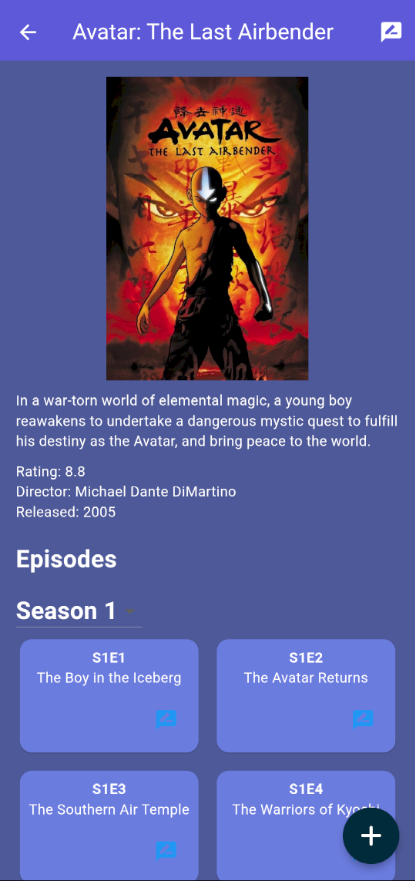

# Series Savvy  

## 📖 Overview  
**Series Savvy** is a cross-platform mobile app (built with **Flutter/Dart**) that serves as a social platform for TV show enthusiasts, inspired by Letterboxd.  

This project was developed **independently** as my final project for the **Mobile Application Development** course during my sophomore year at California Baptist University.  

The app combines user-driven social features with external API integration, allowing users to review, rate, and discuss shows while exploring detailed information about series, episodes, and casts.  

---

## ✨ Features  
- **Cross-Platform:** Built in Flutter, runs on both Android and iOS.  
- **User Authentication:** Account creation, login, and secure password storage via Firestore.  
- **Social Features:** Follow users, like reviews, and track what others are watching.  
- **Reviews & Ratings:** Post reviews on episodes or entire shows with ratings and comments.  
- **Dynamic Media Data:** Fetch show info, episode lists, and cast details from an external API.  
- **Database-Driven:** Firestore stores users, posts, likes, follows, and all activity.  
- **Modern UI:** Built with Flutter widgets for a responsive, intuitive mobile design.  

---

## 📸 Screenshots & Demo  

### Screenshots  





### Demo GIF  


---

## 🛠 Tech Stack  
- **Framework:** Flutter (Dart)  
- **Backend & Database:** Firebase Firestore  
- **API:** External TV show API for series/episode/cast data  
- **Platform:** Android / iOS  

---

## 🚀 Getting Started  

### Prerequisites  
Before running Series Savvy, make sure you have:  
- [Flutter SDK](https://flutter.dev/docs/get-started/install) installed  
- An emulator set up (Android Studio / iOS Simulator) or a physical mobile device  
- A Firebase project configured with Firestore and Authentication enabled  

### Installation Steps  
1. **Clone the repository**  
   ```bash
   git clone https://github.com/jeremymfreeman/mobileappfinal.git
   cd mobileappfinal
